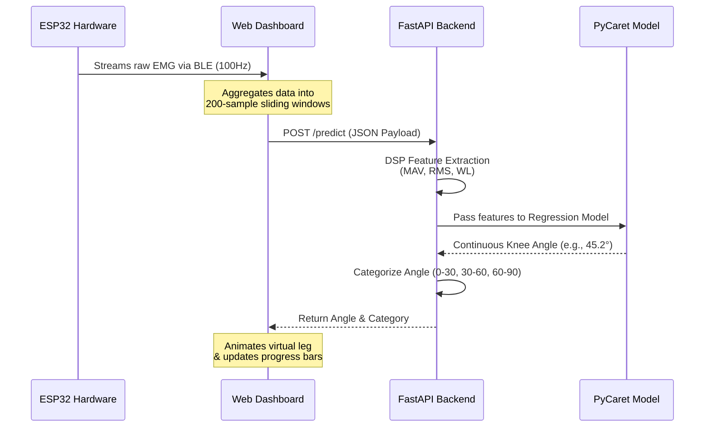

# Exoskeleton EMG Prediction System 🦾

A complete, end-to-end hardware and software architecture designed to predict human knee joint flexion angles in real-time using 4-channel surface Electromyography (sEMG) data. The system bridges the gap between raw biological muscle signals and robotic exoskeleton actuation.

## 📊 System Architecture



## ✨ Features

### Functional Features
- **Hardware Integration**: Reads continuous analog voltage from 4 core muscle groups (Rectus Femoris, Biceps Femoris, Vastus Medialis, Semitendinosus) via an ESP32 microcontroller.
- **Bluetooth Low Energy (BLE) Streaming**: Streams live sensor data directly to a web browser without intermediate desktop software.
- **DSP & Feature Engineering**: Automatically extracts MAV (Mean Absolute Value), RMS (Root Mean Square), and WL (Waveform Length) features from raw sliding windows.
- **Categorical Actuation Logic**: Translates continuous ML predictions into discrete, safe kinematic control ranges (0-30°, 30-60°, 60-90°).
- **Interactive Simulation UI**: A pure HTML/JS dashboard that visualizes muscle activation intensity and dynamically animates a virtual robotic leg.

### Non-Functional Features
- **High Performance & Low Latency**: The FastAPI backend handles inference with optimized sub-millisecond execution times.
- **Decoupled Architecture**: The frontend (browser) and backend (Python API) are strictly separated, allowing the prediction server to be hosted in the cloud (e.g., via Ngrok) or locally.
- **Cross-Platform Accessibility**: The dashboard relies on standard Web Bluetooth API, requiring no native app installation.
- **Robust Error Handling**: Pydantic schemas enforce strict data validation, preventing server crashes from malformed sensor payloads.

## 🚀 Setup & Installation

### 1. Backend API & Machine Learning
Ensure you have Python 3.8+ installed.

1. Install dependencies:
   ```bash
   pip install fastapi uvicorn pydantic pandas numpy scipy pycaret
   ```
2. *(Optional)* Retrain the model on your dataset:
   Place your `A_TXT` and `N_TXT` data folders in the root directory and run:
   ```bash
   python train_model.py
   ```
3. Start the Inference Server:
   ```bash
   uvicorn main:app --host 127.0.0.1 --port 8000
   ```
   *(To expose publicly, use Ngrok: `ngrok http 8000`)*

### 2. Frontend Dashboard
No installation required! 
1. Simply double-click `index.html` to open it in a modern browser (Chrome/Edge recommended for Web Bluetooth support).
2. Paste your local API URL (`http://127.0.0.1:8000`) or Ngrok URL into the connection box and click **Connect Live API**.

### 3. ESP32 Hardware Deployment
1. Open `esp32_emg_ble.ino` in the Arduino IDE.
2. Install the standard ESP32 board manager packages.
3. Wire your analog EMG sensors to pins `32, 33, 34, 35`.
4. Flash the code to your ESP32.
5. On the Web Dashboard, click **Pair ESP32 (BLE)** and select the `ESP32_Exoskeleton_EMG` device to begin streaming live data!

---
*Built as a practical implementation for a Graduation Final Project.*
